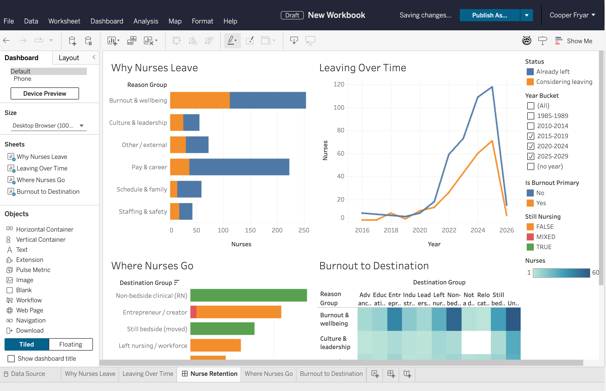
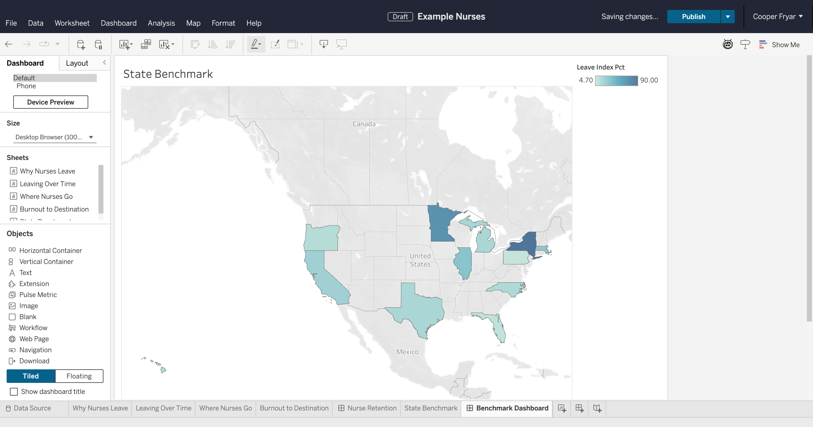
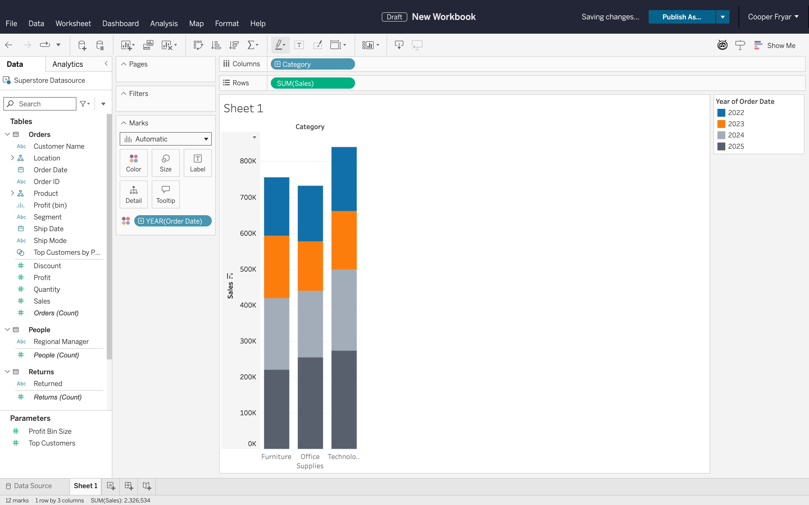
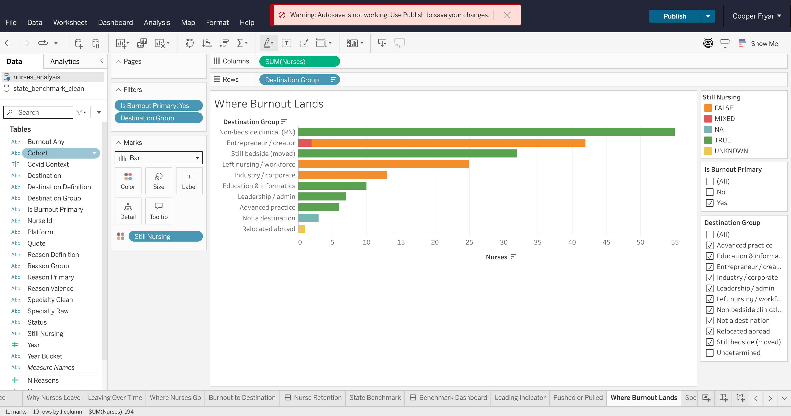

# tableau-vizql-bridge

**Programmatic Tableau Cloud authoring - with no official API.**

This project builds Tableau Cloud worksheets and dashboards (charts, filters,
calculated fields, parameters, analytics objects, formatting) entirely from code,
by driving Tableau Cloud's own **internal VizQL command protocol**. It injects a
tiny dispatcher into the live browser session and sends the same `tabdoc`/`tabsrv`
wire commands the authoring UI fires when you click and drag.

No screen-scraping for the hot path, no brittle pixel automation - direct calls
to the engine. ~80 typed primitives cover most of the authoring surface.



*Every chart, the layout, the filter widgets, and the cross-filter wiring above were authored programmatically - no clicks.*

> ### Note to the Tableau team
> This was reverse-engineered against the undocumented in-page command
> dispatcher, purely to find out how much programmatic authoring is *possible*
> today. The most useful artifact here is **[`PROTOCOL.md`](tableau_interactor/cloud/vizql/PROTOCOL.md)** - a
> catalogue of the exact authoring operations a real programmatic client needs,
> mapped to the wire commands behind them. If there's an official authoring API
> in beta, this is the use-case demand for it, and I'd love access to build the
> same thing on a supported surface.
>
> This is research/experimentation code, not a supported integration, and it
> drives private internals that can change at any release.

---

## What it can do

- **Build charts:** drop fields on any shelf or marks encoding, set mark types,
  change aggregations and date parts, discrete/continuous toggles.
- **Model data:** calculated fields (incl. LOD), groups, sets, bins, parameters.
- **Filter:** categorical, range, top-N, wildcard, condition, relative-date,
  context, and apply-to-worksheets scope.
- **Analyze:** reference/trend lines, bands, box plots, averages, medians.
- **Format:** axes, number formats, per-value colors, palettes, sort, dual axis,
  totals/subtotals.
- **Compose dashboards:** add sheets, layout containers and objects, filter /
  highlight / URL / go-to-sheet / parameter actions, use-as-filter.

The full callable surface is documented in **[`API_REFERENCE.md`](API_REFERENCE.md)**.

## Gallery

All of these were produced by code driving Tableau Cloud through the VizQL bridge:

| | |
|---|---|
|  |  |
| **Geographic dashboard** - filled map with a sequential color scale. | **Stacked bar** - Sales by Category, colored by year. |
|  |  |
| **Bar + live filters** - ranked categories with several quick-filter cards. | **Composed dashboard** - four worksheets, containers, and cross-filters. |

## How it works

Three layers (`tableau_interactor/cloud/vizql/`):

| Layer | File | Role |
|---|---|---|
| Wire bridge | `exec.py` + `dispatcher.js` | Finds the in-page dispatcher *by signature* (survives minifier rotation) and runs `send_command(page, ns, name, params)`. |
| Primitives | `api.py` | ~80 typed functions. Auto-flush UI, auto-cleanup dialogs, typed errors. Fields referenced by display name; encoding quirks hidden. |
| Recipes | `recipes.py` | Parameterized chart builders composed from primitives. |

Discovery/extension tooling lives alongside: `watch.py` (capture req/resp +
dispatcher calls), `hunt.py` (locate the dispatcher), `capture_drop.py`. The
method for discovering a new command is documented in `PROTOCOL.md`.

## Setup

Requires Python ≥ 3.11 and a Tableau Cloud account that can author.

```bash
git clone <this-repo>
cd tableau-vizql-bridge

python -m venv .venv
source .venv/bin/activate
pip install -e .
playwright install chromium

cp .env.example .env      # then fill in your pod URL and credentials
```

## Usage

**1. Start the persistent browser session** (logs in and stays open; everything
else attaches to it over CDP):

```bash
NODE_OPTIONS="--no-deprecation" python -m tableau_interactor.cloud.session
```

A Chromium window opens and signs into Tableau Cloud. **Open or create a
workbook** in that window so you're in an authoring view, then leave it running.

> **Data:** the bundled recipes assume a **Superstore** data source connected to
> the open workbook (they reference fields like `Sales`, `Profit`, `Segment`).
> Superstore ships with Tableau Cloud. The nurse-retention dashboards in the
> screenshots used a separate custom dataset that isn't included here.

**2. Drive it from a script.** The standard shape:

```python
import os
os.environ["NODE_OPTIONS"] = "--no-deprecation"

from tableau_interactor.cloud.vizql.connect import connect_to_workbook_page
from tableau_interactor.cloud.vizql import exec as ex, api

pw, page = connect_to_workbook_page()
try:
    ex.inject_dispatcher(page)            # one-time per session; idempotent
    api.close_open_dialogs(page)          # start clean
    sheet = api.active_sheet_name(page)

    api.drop_field(page, "Ship Mode", "columns", sheet)
    api.drop_field(page, "Sales", "rows", sheet)
    api.drop_field(page, "Segment", "color", sheet)
    api.set_mark_type(page, "bar", sheet)

    print(api.viz_status(page))            # verify state programmatically
finally:
    pw.stop()
```

That's four wire calls, ~2 seconds. Run it with the venv's Python.

## Configuration

All via `.env` (see `.env.example`): `TABLEAU_CLOUD_URL`, `TABLEAU_EMAIL`,
`TABLEAU_PASSWORD`, and optional `TABLEAU_CDP_URL` (default
`http://localhost:9222`).

## Status & caveats

- **Reverse-engineered and unsupported.** It depends on Tableau Cloud's private
  internals and may break on any release. The dispatcher is located by signature
  to be resilient to minifier changes, but no guarantees.
- **Validated against one pod / dataset (Superstore).** Cross-tenant behavior is
  untested - expect to capture a few wire variations on a new environment
  (`PROTOCOL.md` explains the capture workflow).
- **Known sharp edges** are tracked inline in the code and `PROTOCOL.md §
  Known limitations`.

## Optional: Claude Code skill - `/tableau`

`.claude/skills/tableau/SKILL.md` lets [Claude Code](https://claude.com/claude-code)
drive this package conversationally. Type `/tableau` and Claude checks the
session, asks whether you want to continue the open workbook, start a new one, or
do something else, then turns plain-English requests ("build a sales-by-region
bar chart", "add a dashboard that cross-filters it") into wire commands and runs
them. Optional - the library stands alone without it.

## Author & license

Created by **Cooper Fryar**. Released under the [MIT License](LICENSE) - free to
use and adapt; please keep the copyright/attribution notice.

Tableau and Tableau Cloud are trademarks of Salesforce, Inc. This project is an
independent, unofficial experiment and is not affiliated with or endorsed by
Salesforce/Tableau.
